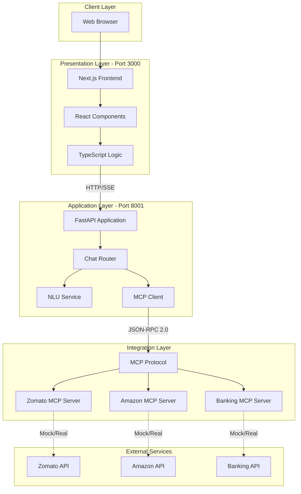
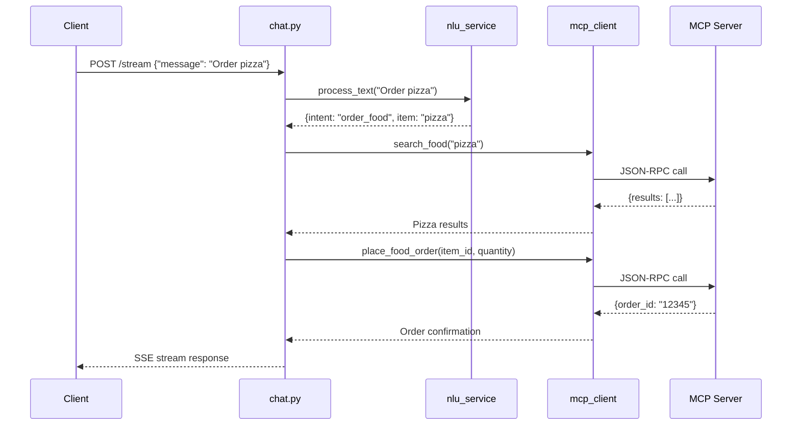
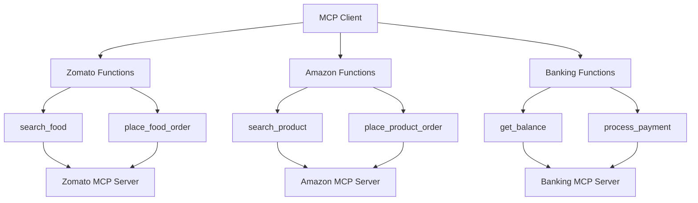
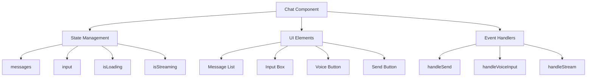
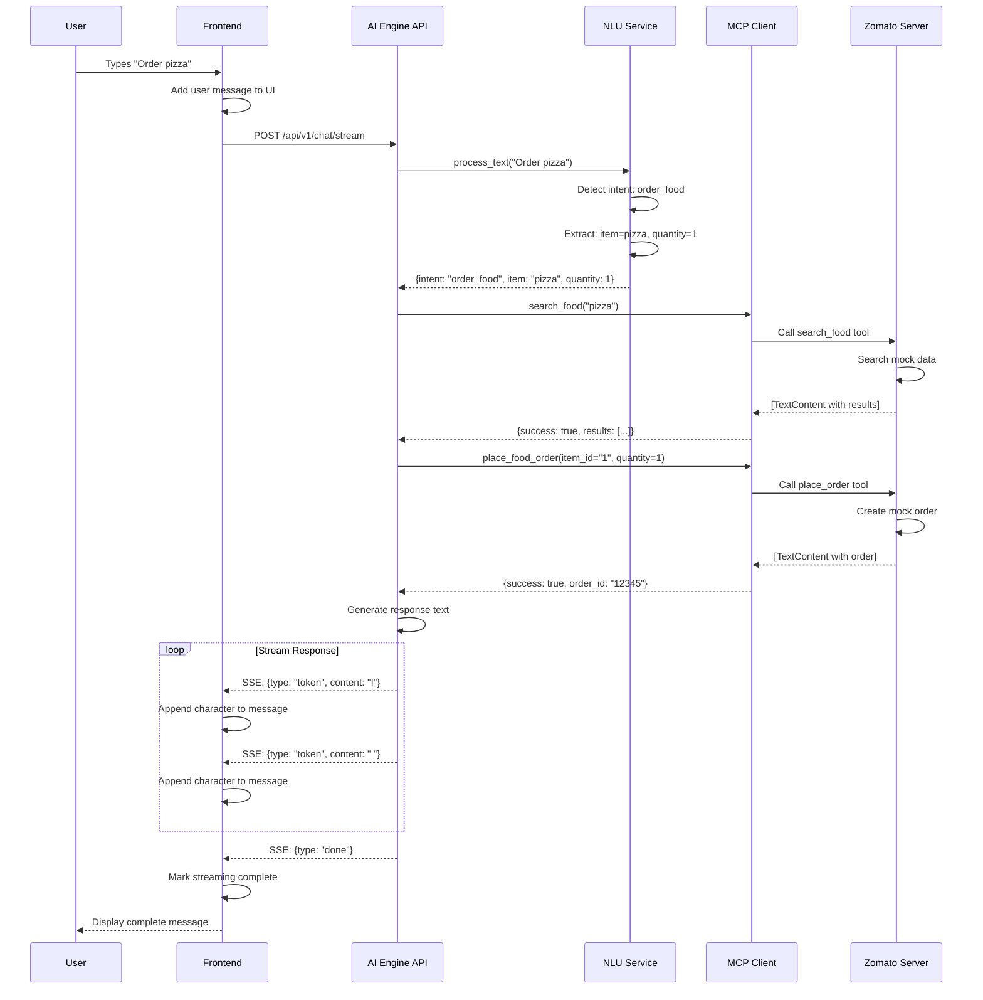

# 📚 AI Personal Assistant - Technical Documentation

> Complete technical reference for developers

---

## 📋 Table of Contents

1. [Architecture Overview](#architecture-overview)
2. [Backend Components](#backend-components)
3. [Frontend Components](#frontend-components)
4. [MCP Protocol Implementation](#mcp-protocol-implementation)
5. [API Reference](#api-reference)
6. [File-by-File Documentation](#file-by-file-documentation)
7. [Data Flow](#data-flow)
8. [Configuration](#configuration)
9. [Deployment](#deployment)

---

## 🏗️ Architecture Overview

### System Architecture



### Technology Stack Details

| Component | Technology | Version | Purpose |
|-----------|-----------|---------|---------|
| **Frontend Framework** | Next.js | 15.x | React framework with SSR |
| **UI Library** | React | 19.x | Component-based UI |
| **Language** | TypeScript | 5.x | Type-safe JavaScript |
| **Styling** | Tailwind CSS + Custom CSS | 3.x | Utility-first CSS |
| **Backend Framework** | FastAPI | 0.104+ | High-performance Python API |
| **ASGI Server** | Uvicorn | 0.24+ | Lightning-fast ASGI server |
| **Data Validation** | Pydantic | 2.0+ | Data validation using Python type hints |
| **MCP SDK** | mcp | 1.0+ | Official Model Context Protocol |
| **HTTP Client** | httpx | 0.25+ | Async HTTP client |

---

## 🔧 Backend Components

### Directory Structure

```
backend/
├── __init__.py                    # Package marker
├── ai_engine/                     # AI Engine package
│   ├── __init__.py
│   ├── main.py                    # FastAPI application entry point
│   └── app/
│       ├── __init__.py
│       ├── core/                  # Core configuration
│       │   ├── __init__.py
│       │   └── config.py          # Settings management
│       ├── routers/               # API route handlers
│       │   ├── __init__.py
│       │   └── chat.py            # Chat endpoints
│       └── services/              # Business logic
│           ├── __init__.py
│           ├── nlu_service.py     # Natural Language Understanding
│           └── mcp_client.py      # MCP client implementation
└── mcp_servers/                   # MCP Servers package
    ├── __init__.py
    ├── core/                      # Shared configuration
    │   ├── __init__.py
    │   └── config.py              # MCP server settings
    └── servers/                   # MCP server implementations
        ├── __init__.py
        ├── zomato_server.py       # Food ordering MCP server
        ├── amazon_server.py       # E-commerce MCP server
        └── banking_server.py      # Banking MCP server
```

---

## 📄 File-by-File Documentation

### Backend Files

#### `backend/ai_engine/main.py`

**Purpose**: FastAPI application entry point

**Code Structure**:
```python
from fastapi import FastAPI
from fastapi.middleware.cors import CORSMiddleware
from backend.ai_engine.app.routers import chat
from backend.ai_engine.app.core.config import settings

app = FastAPI(title=settings.PROJECT_NAME)

# CORS middleware for frontend communication
app.add_middleware(
    CORSMiddleware,
    allow_origins=settings.cors_origins_list,
    allow_credentials=True,
    allow_methods=["*"],
    allow_headers=["*"],
)

# Include chat router
app.include_router(chat.router, prefix="/api/v1/chat", tags=["chat"])
```

**Key Components**:
- **FastAPI App**: Main application instance
- **CORS Middleware**: Enables cross-origin requests from frontend
- **Router Inclusion**: Mounts chat endpoints at `/api/v1/chat`

**Endpoints**:
- `GET /` - Root endpoint (health check)
- `GET /health` - Health check endpoint
- `POST /api/v1/chat/message` - Non-streaming chat
- `POST /api/v1/chat/stream` - Streaming chat

---

#### `backend/ai_engine/app/core/config.py`

**Purpose**: Application configuration management

**Code Structure**:
```python
from pydantic_settings import BaseSettings

class Settings(BaseSettings):
    PROJECT_NAME: str = "AI Personal Assistant"
    AI_ENGINE_PORT: int = 8001
    CORS_ORIGINS: str = "http://localhost:3000"
    
    @property
    def cors_origins_list(self) -> list[str]:
        return [origin.strip() for origin in self.CORS_ORIGINS.split(",")]
    
    class Config:
        env_file = ".env"
        case_sensitive = True

settings = Settings()
```

**Features**:
- **Environment Variables**: Loads from `.env` file
- **Type Safety**: Uses Pydantic for validation
- **CORS Origins**: Parses comma-separated origins

---

#### `backend/ai_engine/app/routers/chat.py`

**Purpose**: Chat API endpoints

**Request Flow**:


**Endpoints**:

1. **POST `/message`** - Non-streaming endpoint
   ```python
   @router.post("/message")
   async def chat(request: ChatRequest):
       intent_data = nlu_service.process_text(request.message)
       # Process intent and return response
       return {"response": "..."}
   ```

2. **POST `/stream`** - Streaming endpoint
   ```python
   @router.post("/stream")
   async def chat_stream(request: ChatRequest):
       async def generate_response():
           # Process message
           # Stream character by character
           for char in response_text:
               yield f"data: {json.dumps({'type': 'token', 'content': char})}\n\n"
       
       return StreamingResponse(generate_response(), media_type="text/event-stream")
   ```

**Intent Handling**:
- `order_food`: Calls Zomato MCP server
- `order_product`: Calls Amazon MCP server
- `check_balance`: Calls Banking MCP server

---

#### `backend/ai_engine/app/services/nlu_service.py`

**Purpose**: Natural Language Understanding

**How It Works**:
```mermaid
graph LR
    A[User Input:<br/>'Order pizza'] --> B[Text Processing:<br/>Lowercase, tokenize]
    B --> C[Intent Detection:<br/>Pattern matching]
    C --> D[Entity Extraction:<br/>Item, quantity]
    D --> E[Output:<br/>{intent, item, quantity}]
    
    style A fill:#e1f5ff
    style E fill:#e1ffe1
```

**Code Structure**:
```python
class NLUService:
    def process_text(self, text: str) -> Dict[str, Any]:
        text_lower = text.lower()
        
        # Food ordering intent
        if "order" in text_lower and any(food in text_lower for food in ["pizza", "biryani"]):
            return {
                "intent": "order_food",
                "item": self._extract_food_item(text_lower),
                "quantity": self._extract_quantity(text_lower)
            }
        
        # Product ordering intent
        elif any(keyword in text_lower for keyword in ["buy", "purchase"]):
            return {
                "intent": "order_product",
                "item": self._extract_product(text_lower),
                "quantity": self._extract_quantity(text_lower)
            }
        
        # Banking intent
        elif "balance" in text_lower:
            return {
                "intent": "check_balance",
                "account_id": "123456"
            }
        
        return {"intent": "unknown"}
```

**Methods**:
- `process_text()`: Main processing function
- `_extract_quantity()`: Extracts numbers from text
- `_extract_amount()`: Extracts monetary amounts

---

#### `backend/ai_engine/app/services/mcp_client.py`

**Purpose**: MCP client for calling MCP servers

**Architecture**:


**Code Structure**:
```python
class MCPClientService:
    async def call_tool(self, server_name: str, tool_name: str, arguments: dict):
        # Import appropriate server
        if server_name == 'zomato':
            from backend.mcp_servers.servers.zomato_server import search_food
            result = await search_food(arguments.get('query', ''))
        
        # Extract and return result
        return json.loads(result[0].text)

# Helper functions
async def search_food(query: str) -> dict:
    return await mcp_client.call_tool('zomato', 'search_food', {'query': query})
```

---

### MCP Server Files

#### `backend/mcp_servers/servers/zomato_server.py`

**Purpose**: MCP server for food ordering

**MCP Server Structure**:
```mermaid
graph TB
    A[MCP Server Instance] --> B[@server.list_tools]
    A --> C[@server.call_tool]
    
    B --> D[Tool Definitions]
    D --> E[search_food]
    D --> F[place_order]
    D --> G[get_restaurant_info]
    
    C --> H[Tool Handler]
    H --> I[search_food function]
    H --> J[place_order function]
    H --> K[get_restaurant_info function]
```

**Code Structure**:
```python
from mcp.server import Server
from mcp.types import Tool, TextContent

server = Server("zomato-server")

@server.list_tools()
async def list_tools() -> list[Tool]:
    return [
        Tool(
            name="search_food",
            description="Search for food items on Zomato",
            inputSchema={
                "type": "object",
                "properties": {
                    "query": {"type": "string", "description": "Food item to search"}
                },
                "required": ["query"]
            }
        ),
        # ... more tools
    ]

@server.call_tool()
async def call_tool(name: str, arguments: dict) -> list[TextContent]:
    if name == "search_food":
        return await search_food(arguments.get("query", ""))
    # ... handle other tools
```

**Tools**:
1. **search_food**: Searches for food items
2. **place_order**: Places a food order
3. **get_restaurant_info**: Gets restaurant details

**Mock Data**:
```python
MOCK_FOOD_ITEMS = [
    {"id": "1", "name": "Cheese Pizza", "restaurant": "Pizza Hut", "price": 15.0},
    {"id": "2", "name": "Chicken Biryani", "restaurant": "Paradise", "price": 12.0},
    # ...
]
```

---

#### `backend/mcp_servers/servers/amazon_server.py`

**Purpose**: MCP server for e-commerce

**Tools**:
1. **search_product**: Searches for products
2. **place_order**: Places a product order
3. **get_product_details**: Gets product information

**Similar structure to Zomato server**

---

#### `backend/mcp_servers/servers/banking_server.py`

**Purpose**: MCP server for banking operations

**Tools**:
1. **get_balance**: Gets account balance
2. **process_payment**: Processes payments
3. **get_transaction_history**: Gets transaction history

---

## 🎨 Frontend Components

### Directory Structure

```
frontend/
├── app/
│   ├── page.tsx                 # Main page component
│   ├── layout.tsx               # Root layout
│   ├── globals.css              # Global styles
│   └── components/
│       └── Chat.tsx             # Chat component
├── public/                      # Static assets
└── package.json                 # Dependencies
```

---

### `frontend/app/page.tsx`

**Purpose**: Main page component

**Code Structure**:
```typescript
import Chat from './components/Chat';

export default function Home() {
  return (
    <main className="min-h-screen bg-gradient-to-br from-purple-900 via-blue-900 to-black">
      <Chat />
    </main>
  );
}
```

---

### `frontend/app/components/Chat.tsx`

**Purpose**: Chat interface component

**Component Architecture**:


**Key Features**:
1. **Streaming Responses**: Character-by-character display
2. **Voice Input**: Web Speech API integration
3. **Voice Output**: Text-to-speech
4. **Smooth Animations**: 60fps animations
5. **Auto-scroll**: Follows conversation

**Code Structure**:
```typescript
'use client';
import { useState, useRef, useEffect } from 'react';

export default function Chat() {
  const [messages, setMessages] = useState([]);
  const [input, setInput] = useState('');
  const [isStreaming, setIsStreaming] = useState(false);
  
  const handleSend = async () => {
    // Send message to backend
    const response = await fetch('http://localhost:8001/api/v1/chat/stream', {
      method: 'POST',
      headers: {'Content-Type': 'application/json'},
      body: JSON.stringify({message: input})
    });
    
    // Handle streaming response
    const reader = response.body.getReader();
    // ... stream processing
  };
  
  return (
    <div className="chat-container">
      {/* Messages */}
      {/* Input */}
      {/* Voice button */}
    </div>
  );
}
```

---

## 🔄 Data Flow

### Complete Request-Response Flow



---

## ⚙️ Configuration

### Environment Variables

**AI Engine** (`.env`):
```bash
# Server Configuration
AI_ENGINE_PORT=8001
PROJECT_NAME="AI Personal Assistant"
DEBUG=true

# CORS Configuration
CORS_ORIGINS=http://localhost:3000,http://127.0.0.1:3000

# Logging
LOG_LEVEL=INFO
```

**MCP Servers**:
```bash
# Zomato Configuration
ZOMATO_API_KEY=your_key_here
ZOMATO_MOCK_MODE=true

# Amazon Configuration
AMAZON_API_KEY=your_key_here
AMAZON_MOCK_MODE=true

# Banking Configuration
BANK_API_KEY=your_key_here
BANK_MOCK_MODE=true
```

**Frontend**:
```bash
NEXT_PUBLIC_API_URL=http://localhost:8001
```

---

## 📡 API Reference

### Chat Endpoints

#### POST `/api/v1/chat/message`

**Description**: Non-streaming chat endpoint

**Request**:
```json
{
  "message": "Order me a pizza"
}
```

**Response**:
```json
{
  "response": "I have placed an order for Cheese Pizza from Pizza Hut. Order ID: ZOMATO-12345. Estimated delivery: 30-40 mins."
}
```

---

#### POST `/api/v1/chat/stream`

**Description**: Streaming chat endpoint (SSE)

**Request**:
```json
{
  "message": "Order me a pizza"
}
```

**Response** (Server-Sent Events):
```
data: {"type": "token", "content": "I"}

data: {"type": "token", "content": " "}

data: {"type": "token", "content": "h"}

...

data: {"type": "done"}
```

---

## 🚀 Deployment

### Production Checklist

- [ ] Set `MOCK_MODE=false` for all services
- [ ] Add real API keys to `.env`
- [ ] Set `DEBUG=false`
- [ ] Configure production CORS origins
- [ ] Set up HTTPS
- [ ] Configure logging
- [ ] Set up monitoring
- [ ] Configure database (if needed)
- [ ] Set up CI/CD pipeline
- [ ] Configure auto-scaling

### Docker Deployment

```bash
# Build and run with Docker Compose
docker-compose up -d
```

---

## 📊 Performance Optimization

### Backend Optimization
- **Async/Await**: All I/O operations are async
- **Connection Pooling**: Reuse HTTP connections
- **Caching**: Cache frequent requests

### Frontend Optimization
- **Code Splitting**: Next.js automatic code splitting
- **Lazy Loading**: Components loaded on demand
- **Image Optimization**: Next.js image optimization
- **CSS Optimization**: Tailwind CSS purging

---

## 🔒 Security

### Best Practices
- **Environment Variables**: Never commit `.env` files
- **API Keys**: Store securely, rotate regularly
- **CORS**: Restrict to known origins
- **Input Validation**: Validate all user inputs
- **Rate Limiting**: Prevent abuse
- **HTTPS**: Use in production

---

## 📝 Summary

This documentation covers:
- ✅ Complete architecture overview
- ✅ Detailed file-by-file documentation
- ✅ Data flow diagrams
- ✅ API reference
- ✅ Configuration guide
- ✅ Deployment instructions
- ✅ Performance optimization
- ✅ Security best practices

For beginner-friendly explanations, see [PROJECT_GUIDE.md](PROJECT_GUIDE.md).
