# 🤖 AI Personal Assistant - Complete Guide for Beginners

> **Think of this like a LEGO instruction manual** - We'll build your AI assistant step by step!

---

## 🎯 What Is This Project?

Imagine having a **smart robot friend** that can:
- 🍕 Order pizza for you (from Zomato)
- 📦 Buy things online (from Amazon)
- 💰 Check your bank balance
- 🗣️ Talk to you with voice
- 💬 Chat with you in a beautiful app

**That's what this project does!** It's like having Siri or Alexa, but one you built yourself!

---

## 🏗️ How Is It Built? (The Big Picture)

Think of this project like a **house with 3 rooms**:

```mermaid
graph TB
    A[🖥️ Frontend<br/>The Pretty Face<br/>What you see and click] --> B[🧠 AI Engine<br/>The Smart Brain<br/>Understands what you want]
    B --> C[🔧 MCP Servers<br/>The Helpers<br/>Do the actual work]
    
    C --> D[🍕 Zomato Helper<br/>Orders food]
    C --> E[📦 Amazon Helper<br/>Buys stuff]
    C --> F[💰 Banking Helper<br/>Checks money]
    
    style A fill:#e1f5ff
    style B fill:#fff4e1
    style C fill:#f0e1ff
    style D fill:#ffe1e1
    style E fill:#e1ffe1
    style F fill:#ffe1f5
```



### The 3 Main Parts:

1. **Frontend** (The Pretty Face) 🎨
   - What you see in your web browser
   - Has buttons, text boxes, and looks nice
   - Like the screen on your phone

2. **AI Engine** (The Smart Brain) 🧠
   - Understands what you're saying
   - Decides what to do
   - Like your brain thinking

3. **MCP Servers** (The Helpers) 🔧
   - Actually do the work
   - One helper for food, one for shopping, one for banking
   - Like having 3 robot assistants

---

## 📁 Project Structure (What's Inside the Box?)

```
ai-personal-assistant/          ← The main box
│
├── backend/                    ← The "brain" folder
│   ├── ai_engine/             ← The thinking part
│   │   ├── main.py            ← The boss file (starts everything)
│   │   └── app/               ← Helper files
│   │       ├── core/          ← Settings and rules
│   │       ├── routers/       ← Handles conversations
│   │       └── services/      ← Does the smart stuff
│   │
│   └── mcp_servers/           ← The "helpers" folder
│       ├── core/              ← Helper settings
│       └── servers/           ← The 3 robot helpers
│           ├── zomato_server.py    ← Food helper 🍕
│           ├── amazon_server.py    ← Shopping helper 📦
│           └── banking_server.py   ← Money helper 💰
│
├── frontend/                   ← The "pretty face" folder
│   ├── app/                   ← The web pages
│   │   ├── page.tsx           ← Main page
│   │   └── components/        ← Reusable pieces
│   │       └── Chat.tsx       ← The chat box
│   └── public/                ← Pictures and icons
│
├── requirements.txt           ← Shopping list (what to install)
├── setup.py                   ← Installation instructions
├── .env.example              ← Settings template
└── start.py                  ← The "START" button!
```

---

## 🚀 How to Start (Step by Step)

### Step 1: Get the Tools Ready 🛠️

You need 2 things installed on your computer:

1. **Python** (version 3.9 or newer)
   - Like the language the brain speaks
   - Download from: https://python.org

2. **Node.js** (version 18 or newer)
   - Like the language the face speaks
   - Download from: https://nodejs.org

**How to check if you have them:**
```bash
python --version    # Should show: Python 3.9 or higher
node --version      # Should show: v18 or higher
```

---

### Step 2: Install the Project 📥

**Think of this like downloading a game:**

```bash
# 1. Go to the project folder
cd ai-personal-assistant

# 2. Install the brain's tools
pip install -r requirements.txt

# 3. Install the face's tools
cd frontend
npm install
cd ..
```

**What just happened?**
- `pip install` = Downloaded all the brain's tools
- `npm install` = Downloaded all the face's tools

---

### Step 3: Start Everything! 🎮

**The easiest way (One command does it all!):**

```bash
python start.py
```

**What happens:**
1. 🧠 Brain starts (AI Engine on port 8001)
2. 🎨 Face starts (Frontend on port 3000)
3. 🔧 Helpers wake up automatically when needed

**You'll see:**
```
✅ AI Engine is ready!
✅ Frontend is ready!

📍 Open your browser to: http://localhost:3000
```

---

### Step 4: Use It! 🎉

1. **Open your web browser**
2. **Go to:** `http://localhost:3000`
3. **Try saying:**
   - "Order me a pizza" 🍕
   - "Buy me a Kindle" 📚
   - "Check my balance" 💰

---

## 🎨 What Each File Does (The Details)

### Backend Files (The Brain)

#### `backend/ai_engine/main.py` - The Boss
```python
# This file is like the manager
# It starts the AI Engine and sets up everything
```

**What it does:**
- Starts the web server
- Sets up the chat system
- Connects everything together

---

#### `backend/ai_engine/app/routers/chat.py` - The Conversation Handler
```python
# This file handles your messages
# When you say "Order pizza", this file figures out what to do
```

**Flow:**


---

#### `backend/ai_engine/app/services/nlu_service.py` - The Understanding Part
```python
# NLU = Natural Language Understanding
# This is like teaching the AI to understand English
```

**What it does:**
- Reads your message
- Figures out what you want
- Decides which helper to call

**Example:**
```
You say: "Order pizza"
NLU thinks: "Hmm, 'order' + 'pizza' = food order!"
NLU decides: "Call the Zomato helper!"
```

---

#### `backend/ai_engine/app/services/mcp_client.py` - The Helper Caller
```python
# This file talks to the MCP helpers
# It's like a phone that calls the robot assistants
```

**What it does:**
- Connects to Zomato helper
- Connects to Amazon helper
- Connects to Banking helper
- Sends them requests

---

### MCP Server Files (The Helpers)

#### `backend/mcp_servers/servers/zomato_server.py` - Food Helper 🍕

**What it can do:**
1. **search_food** - Find food items
2. **place_order** - Order food
3. **get_restaurant_info** - Get restaurant details

**Flow:**


---

#### `backend/mcp_servers/servers/amazon_server.py` - Shopping Helper 📦

**What it can do:**
1. **search_product** - Find products
2. **place_order** - Buy products
3. **get_product_details** - Get product info

---

#### `backend/mcp_servers/servers/banking_server.py` - Money Helper 💰

**What it can do:**
1. **get_balance** - Check your money
2. **process_payment** - Make payments
3. **get_transaction_history** - See past transactions

---

### Frontend Files (The Pretty Face)

#### `frontend/app/page.tsx` - The Main Page
```typescript
// This is the first page you see
// It shows the chat interface
```

---

#### `frontend/app/components/Chat.tsx` - The Chat Box
```typescript
// This is the chat window where you talk to the AI
// It has:
// - Text input box
// - Send button
// - Voice button
// - Message history
```

**Features:**
- 💬 Type messages
- 🎤 Voice input
- 🔊 Voice output
- ✨ Smooth animations
- 🌊 Streaming responses (like ChatGPT)

---

## 🔧 Configuration Files

### `requirements.txt` - The Shopping List
```txt
fastapi>=0.104.0      ← Web framework (like a toolbox)
uvicorn>=0.24.0       ← Web server (like a delivery truck)
pydantic>=2.0.0       ← Data validator (like a quality checker)
mcp>=1.0.0            ← MCP protocol (the helper language)
```

**What it means:**
- Each line is a tool the brain needs
- The `>=` means "this version or newer"

---

### `.env.example` - The Settings Template
```bash
# Copy this file to .env and fill in your details

# AI Engine Settings
AI_ENGINE_PORT=8001           ← Which door the brain uses

# Mock Mode (for testing without real APIs)
ZOMATO_MOCK_MODE=true        ← Use fake data for testing
AMAZON_MOCK_MODE=true
BANK_MOCK_MODE=true
```

**Mock Mode = Practice Mode**
- When `true`: Uses fake data (safe for testing)
- When `false`: Uses real APIs (needs real API keys)

---

## 🎮 How to Use (Common Tasks)

### Task 1: Order Food 🍕

**Say:** "Order me a pizza"

**What happens behind the scenes:**


---

### Task 2: Buy Something 📦

**Say:** "Buy me a Kindle"

**Flow:**
1. AI understands you want to shop
2. Calls Amazon helper
3. Searches for Kindle
4. Places order
5. Shows confirmation

---

### Task 3: Check Balance 💰

**Say:** "What's my balance?"

**Flow:**
1. AI understands you want banking info
2. Calls Banking helper
3. Gets your balance
4. Shows you the amount

---

## 🐛 Troubleshooting (When Things Go Wrong)

### Problem: "Port already in use"
**Solution:**
```bash
# Stop the running server first
# Then start again
python start.py
```

---

### Problem: "Module not found"
**Solution:**
```bash
# Install dependencies again
pip install -r requirements.txt
```

---

### Problem: "Frontend won't start"
**Solution:**
```bash
cd frontend
npm install
npm run dev
```

---

## 🎓 Learning Path (How to Understand More)

### Level 1: Beginner 🌱
- ✅ You are here! You know how to start it
- Next: Try different commands
- Learn: What each helper does

### Level 2: Intermediate 🌿
- Understand how NLU works
- Learn about MCP protocol
- Modify the responses

### Level 3: Advanced 🌳
- Add new helpers
- Connect real APIs
- Deploy to production

---

## 📚 Key Concepts Explained Simply

### What is MCP?
**Model Context Protocol** = A standard way for AI to talk to helpers

**Like:**
- English is a language humans use
- MCP is a language AI helpers use
- It makes sure everyone understands each other

---

### What is FastAPI?
**FastAPI** = A tool to build web services

**Like:**
- A restaurant kitchen (processes requests)
- Takes orders (your messages)
- Prepares food (processes them)
- Serves it (sends responses)

---

### What is Next.js?
**Next.js** = A tool to build beautiful websites

**Like:**
- A painter's canvas
- Makes things look pretty
- Makes things interactive
- Makes things fast

---

## 🎯 Summary

**You now know:**
- ✅ What this project does (AI assistant)
- ✅ How it's structured (3 main parts)
- ✅ How to start it (`python start.py`)
- ✅ How to use it (just talk to it!)
- ✅ What each file does
- ✅ How everything connects

**Next steps:**
1. Try it out!
2. Experiment with different commands
3. Look at the code
4. Make it your own!

---

## 🤝 Need Help?

- 📖 Read the [DOCUMENTATION.md](DOCUMENTATION.md) for technical details
- 📝 Check [README.md](README.md) for quick reference
- 🐛 Found a bug? Check the troubleshooting section

---

**Remember:** Every expert was once a beginner. Take your time, experiment, and have fun! 🚀
