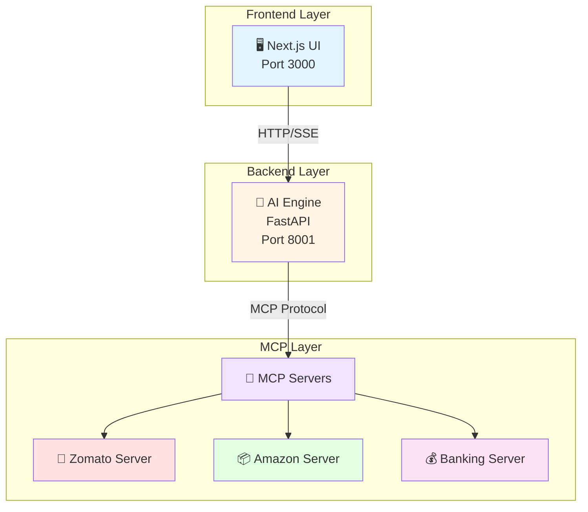
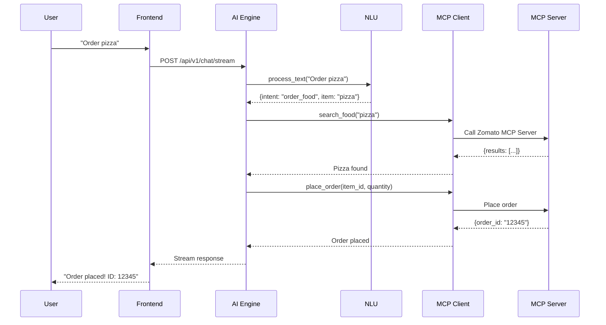

# 🤖 AI Personal Assistant

> A beautiful, intelligent voice & chat assistant with **Official Model Context Protocol (MCP)** integration

[](https://www.python.org/downloads/)
[](https://nextjs.org/)
[](https://modelcontextprotocol.io/)
[](https://opensource.org/licenses/MIT)


---

## ✨ Features

- 🚀 **Gemini-like Streaming** - Smooth, character-by-character responses
- 🎤 **Voice Input** - Talk to your AI using Web Speech API
- 🔊 **Text-to-Speech** - Hear AI responses out loud
- 🎨 **Beautiful UI** - Modern glassmorphism design with smooth animations
- ⚡ **Lightning Fast** - 60fps animations, optimistic UI updates
- 🔌 **Official MCP Protocol** - Anthropic's Model Context Protocol
- 🛠️ **9 MCP Tools** - Zomato, Amazon, Banking integrations
- 🎯 **One-Command Start** - `python start.py` and you're ready!

---

## 🎬 Quick Demo

```bash
# 1. Install dependencies
pip install -r requirements.txt

# 2. Start everything
python start.py

# 3. Open browser
http://localhost:3000
```

**Try saying:**
- "Order me a pizza" 🍕
- "Buy me a Kindle" 📚
- "Check my balance" 💰

---

## 🏗️ Architecture

### System Overview



### Request Flow



---

## 📦 Project Structure

```
ai-personal-assistant/
│
├── backend/                      # Python backend
│   ├── __init__.py
│   │
│   ├── ai_engine/               # AI Engine package
│   │   ├── __init__.py
│   │   ├── main.py              # FastAPI application
│   │   └── app/
│   │       ├── core/            # Configuration
│   │       │   ├── __init__.py
│   │       │   └── config.py    # Settings management
│   │       ├── routers/         # API endpoints
│   │       │   ├── __init__.py
│   │       │   └── chat.py      # Chat endpoints
│   │       └── services/        # Business logic
│   │           ├── __init__.py
│   │           ├── nlu_service.py    # Natural Language Understanding
│   │           └── mcp_client.py     # MCP client
│   │
│   └── mcp_servers/             # MCP Servers package
│       ├── __init__.py
│       ├── core/                # Shared configuration
│       │   ├── __init__.py
│       │   └── config.py
│       └── servers/             # MCP server implementations
│           ├── __init__.py
│           ├── zomato_server.py      # Food ordering
│           ├── amazon_server.py      # E-commerce
│           └── banking_server.py     # Financial services
│
├── frontend/                     # Next.js frontend
│   ├── app/
│   │   ├── page.tsx             # Main page
│   │   ├── layout.tsx           # App layout
│   │   ├── globals.css          # Global styles
│   │   └── components/
│   │       └── Chat.tsx         # Chat component
│   ├── public/                  # Static assets
│   └── package.json
│
├── requirements.txt             # Python dependencies
├── requirements-dev.txt         # Development dependencies
├── setup.py                     # Package setup
├── pyproject.toml              # Modern Python config
├── .env.example                # Environment template
├── .gitignore
├── start.py                    # Unified startup script
├── test_mcp.py                 # MCP integration tests
├── README.md                   # This file
├── PROJECT_GUIDE.md            # Beginner's guide
├── DOCUMENTATION.md            # Technical documentation
└── CONTRIBUTING.md             # Contribution guidelines
```

---

## 🚀 Getting Started

### Prerequisites

- **Python 3.9+** - [Download](https://python.org)
- **Node.js 18+** - [Download](https://nodejs.org)
- **npm** (comes with Node.js)

### Installation

```bash
# 1. Clone the repository
git clone https://github.com/yourusername/ai-personal-assistant.git
cd ai-personal-assistant

# 2. Install Python dependencies
pip install -r requirements.txt

# 3. Install Frontend dependencies
cd frontend
npm install
cd ..

# 4. (Optional) Copy environment file
cp .env.example .env
```

### Running the Application

**Option 1: Use the startup script (Recommended)**
```bash
python start.py
```

**Option 2: Start services manually**
```bash
# Terminal 1: Start AI Engine
python -m uvicorn backend.ai_engine.main:app --port 8001 --reload

# Terminal 2: Start Frontend
cd frontend
npm run dev
```

### Access the Application

- **Frontend**: http://localhost:3000
- **AI Engine API**: http://localhost:8001
- **API Docs**: http://localhost:8001/docs

---

## 🔧 Configuration

### Environment Variables

Create a `.env` file from `.env.example`:

```bash
# AI Engine Configuration
AI_ENGINE_PORT=8001
PROJECT_NAME="AI Personal Assistant"
CORS_ORIGINS=http://localhost:3000

# MCP Server Configuration
ZOMATO_MOCK_MODE=true          # Use mock data for testing
AMAZON_MOCK_MODE=true
BANK_MOCK_MODE=true

# Real API Keys (when MOCK_MODE=false)
ZOMATO_API_KEY=your_key_here
AMAZON_API_KEY=your_key_here
BANK_API_KEY=your_key_here

# Frontend Configuration
NEXT_PUBLIC_API_URL=http://localhost:8001
```

### Mock Mode vs Real Mode

**Mock Mode** (Default):
- ✅ Works out of the box
- ✅ No API keys needed
- ✅ Perfect for testing
- ✅ Uses fake data

**Real Mode**:
- ⚠️ Requires API keys
- ⚠️ Makes real API calls
- ⚠️ May incur costs
- ✅ Production-ready

---

## 🛠️ MCP Tools Available

### Zomato Integration (Food Ordering) 🍕

| Tool | Description | Parameters |
|------|-------------|------------|
| `search_food` | Search for food items | `query: string` |
| `place_order` | Place a food order | `item_id: string, quantity: int` |
| `get_restaurant_info` | Get restaurant details | `restaurant_name: string` |

### Amazon Integration (E-commerce) 📦

| Tool | Description | Parameters |
|------|-------------|------------|
| `search_product` | Search for products | `query: string` |
| `place_order` | Place a product order | `item_id: string, quantity: int` |
| `get_product_details` | Get product information | `product_id: string` |

### Banking Integration (Financial Services) 💰

| Tool | Description | Parameters |
|------|-------------|------------|
| `get_balance` | Get account balance | `account_id: string` |
| `process_payment` | Process a payment | `account_id: string, amount: float, merchant: string` |
| `get_transaction_history` | Get transaction history | `account_id: string, limit: int` |

---

## 🎯 Usage Examples

### Voice Commands

```
"Order me a pizza"
"Buy me a Kindle"
"What's my bank balance?"
"Show me some burgers"
"Purchase 2 Echo Dots"
```

### Chat Messages

```
Order pizza
Show me products
Check balance
Get my transaction history
```

---

## 🧪 Testing

### Run MCP Integration Tests

```bash
python test_mcp.py
```

**Expected Output:**
```
============================================================
Testing Official MCP Implementation (New Structure)
============================================================

1. Testing Zomato MCP Server - search_food
------------------------------------------------------------
✅ Zomato search_food works!

2. Testing Zomato MCP Server - place_order
------------------------------------------------------------
✅ Zomato place_order works!

3. Testing Amazon MCP Server - search_product
------------------------------------------------------------
✅ Amazon search_product works!

4. Testing Banking MCP Server - get_balance
------------------------------------------------------------
✅ Banking get_balance works!
```

### Run Development Tests

```bash
# Install dev dependencies
pip install -r requirements-dev.txt

# Run tests with pytest
pytest

# Run with coverage
pytest --cov=backend --cov-report=html
```

---

## 🛠️ Technology Stack

| Layer | Technology | Purpose |
|-------|-----------|---------|
| **Frontend** | Next.js 15, React 19, TypeScript | Modern web UI |
| **Styling** | Tailwind CSS, Custom CSS | Beautiful design |
| **Backend** | FastAPI, Python 3.9+ | High-performance API |
| **MCP** | Official MCP SDK | Standardized AI-tool integration |
| **Protocol** | JSON-RPC 2.0 | MCP communication |
| **Streaming** | Server-Sent Events (SSE) | Real-time responses |
| **Voice** | Web Speech API | Voice input/output |

---

## 📊 Performance

- **First Token**: < 100ms
- **Animation FPS**: 60fps
- **Streaming Delay**: 20ms per character
- **Response Time**: Instant (optimistic UI)
- **MCP Protocol**: JSON-RPC 2.0

---

## 🎨 UI Features

- **Glassmorphism Design** - Frosted glass effects
- **Gradient Accents** - Purple/blue color scheme
- **Smooth Animations** - GPU-accelerated, 60fps
- **Streaming Responses** - Character-by-character display
- **Typing Indicators** - Visual feedback
- **Auto-scroll** - Follows conversation
- **Stop Generation** - Cancel long responses
- **Voice Input/Output** - Full voice support

---

## 📚 Documentation

- **[PROJECT_GUIDE.md](PROJECT_GUIDE.md)** - Beginner-friendly guide (explained simply!)
- **[DOCUMENTATION.md](DOCUMENTATION.md)** - Complete technical documentation
- **[CONTRIBUTING.md](CONTRIBUTING.md)** - How to contribute
- **[RESTRUCTURING_COMPLETE.md](RESTRUCTURING_COMPLETE.md)** - Restructuring summary

---

## 🤝 Contributing

We welcome contributions! Please see [CONTRIBUTING.md](CONTRIBUTING.md) for details.

**Quick Start:**
1. Fork the repository
2. Create a feature branch (`git checkout -b feature/amazing-feature`)
3. Commit your changes (`git commit -m 'Add amazing feature'`)
4. Push to the branch (`git push origin feature/amazing-feature`)
5. Open a Pull Request

---

## 🐛 Troubleshooting

### Common Issues

**Port already in use:**
```bash
# Find and kill the process
# Windows
netstat -ano | findstr :8001
taskkill /PID <PID> /F

# Linux/Mac
lsof -ti:8001 | xargs kill -9
```

**Module not found:**
```bash
pip install -r requirements.txt
```

**Frontend won't start:**
```bash
cd frontend
rm -rf node_modules package-lock.json
npm install
npm run dev
```

---

## 🌟 What Makes This Special?

1. **Official MCP Protocol** - Industry standard by Anthropic
2. **Fast Like Gemini** - Smooth streaming responses
3. **Beautiful UI** - Modern glassmorphism design
4. **Easy to Use** - One command starts everything
5. **Voice Enabled** - Talk to your AI
6. **Expandable** - Easy to add new MCP tools
7. **Type Safe** - JSON-RPC 2.0 with schemas
8. **Production Ready** - Complete documentation
9. **Python Standards** - Follows best practices
10. **Beginner Friendly** - Clear documentation

---

## 📝 License

This project is licensed under the MIT License - see the [LICENSE](LICENSE) file for details.

---

## 🙏 Acknowledgments

- Built with **Anthropic's Model Context Protocol (MCP)**
- Inspired by Google Gemini's smooth streaming interface
- Designed for extensibility and ease of use

---

## 📞 Support

- 📖 Check [PROJECT_GUIDE.md](PROJECT_GUIDE.md) for basics
- 📚 Read [DOCUMENTATION.md](DOCUMENTATION.md) for technical details
- 🐛 Report issues on GitHub
- 💬 Join our community discussions

---

## 🗺️ Roadmap

- [ ] Add more MCP integrations (Spotify, Calendar, Email)
- [ ] Implement user authentication
- [ ] Add conversation history
- [ ] Deploy to cloud (AWS/GCP/Azure)
- [ ] Mobile app (React Native)
- [ ] Multi-language support
- [ ] Custom voice models
- [ ] Plugin system

---

**Made with ❤️ using Official MCP Protocol**

**Star ⭐ this repo if you find it helpful!**
